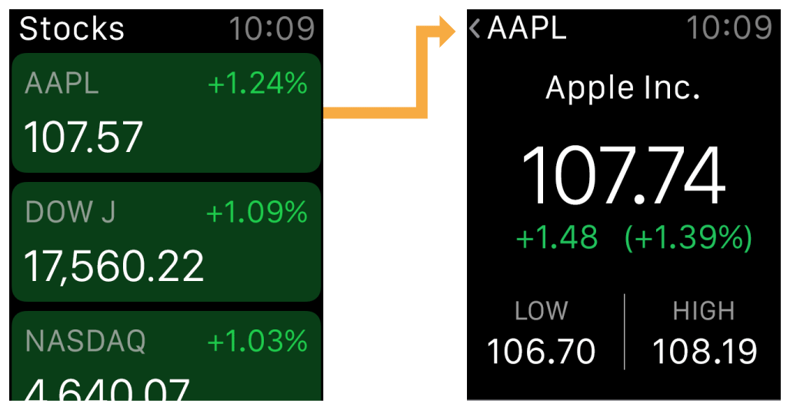
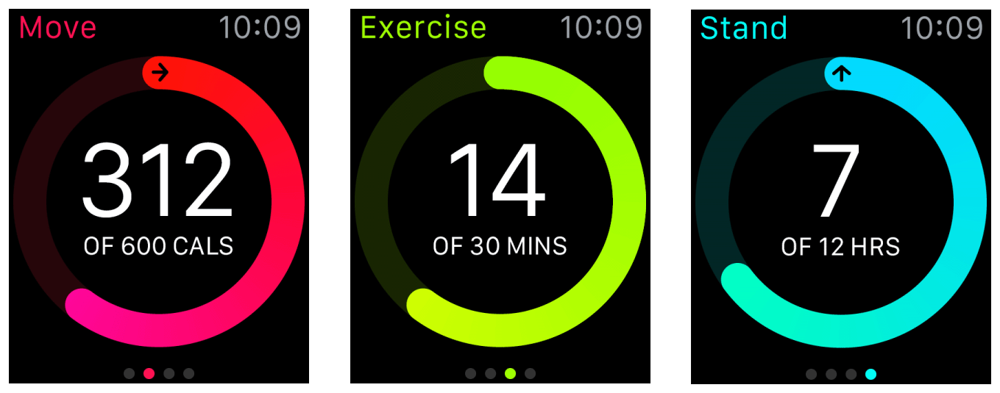

# App详解 - App Anatomy

Apple Watch 必须和用户的 iPhone 上的 app 匹配。

## 导航样式
WatchKit apps支持两种导航：
* **层级模式。**这种模式和 IOS 中的导航相类似，适合数据结构有一定层级关系的 app 。在这种模式下的 app ，用户选择页面中的一个选项进入下一级导航，重复操作直到他进入最终的页面。如果用户想选择其他内容，就必须退出当前层级回到前面再重新选择。

* **翻页模式。**翻页界面让用户通过水平滑动屏幕来翻页。这种模式适合那些数据模型简单，每页内容间没有什么关联的 app 。每一页的底部都有小点来表示用户所在导航页。为了简化导航页，请使你导航界面的内容尽可能的短小。

你不能同时使用层级模式和翻页模式，当你设计 app 时，你需要选择出适合你 app 内容的导航模式。

每一种导航模式都可以使用模态视图，模态视图给用户提供了一种不被打断就可以完成操作或获取信息的方式，但是在模态视图中，用户会暂时不能使用其他 app 。想了解更多模态视图，请点击 [Modal Sheets](https://developer.apple.com/library/prerelease/ios/documentation/UserExperience/Conceptual/WatchHumanInterfaceGuidelines/ModalContexts.html#//apple_ref/doc/uid/TP40014992-CH6-SW1)

## 交互方式
* **基于点击事件。**点击用以选择或响应。简单的点击动作是和你的 app 进行交互最普通的方式。选择列表中的一行、按钮、选择钮和其他的控件都是通过点击实现的。用户点击的内容会传递给你 WatchKit 中的代码来实现功能。

* **手势。**此功能会实现你的所有手势，使用它们来实现你的标准动作：

  * 垂直滑动使你的屏幕上下滚动。
  * 水平滑动用于在翻页模式翻页。
  * 向左滑动返回上一级界面。

  Apple Watch不支持多指手势。

* **Force Touch。**就像感应触控，Retina 屏幕也可以探测到用户手指的接近。当系统感应到手指，它会播出和当前页面内容有关的背景菜单。 App 使用这种方法展现和当前内容相关的信息。
想了解更多菜单，请点击 [Menus](https://developer.apple.com/library/prerelease/ios/documentation/UserExperience/Conceptual/WatchHumanInterfaceGuidelines/Menus.html#//apple_ref/doc/uid/TP40014992-CH14-SW1) 。

* **The Digital Crown。**用于调整位置，加速滚动条不阻碍 Apple Watch 的显示，用户能轻松浏览内容很长的页面，快速滑动到长内容中的某一部分。The Digital Crown 在第三代 app 中只能用于滚动条。
