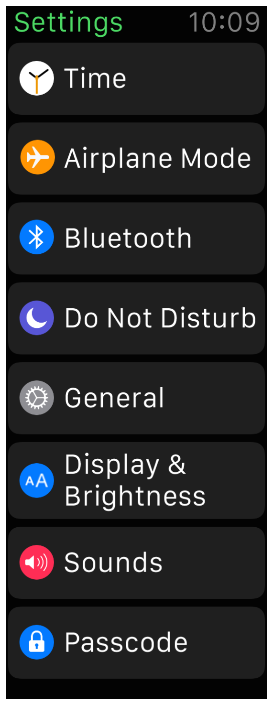
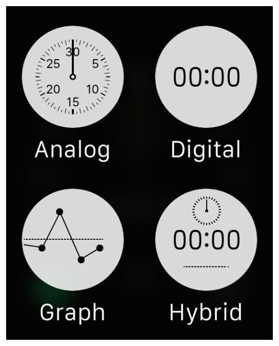
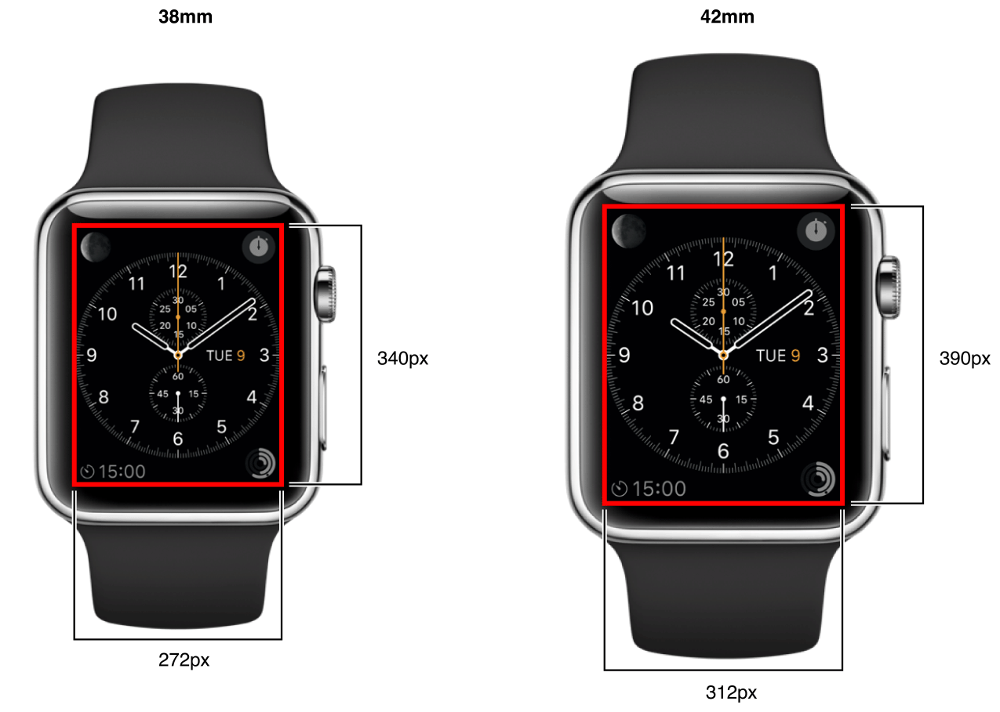

#布局- Layout
应用程序在不同尺寸的 Apple Watch 上展示相同的界面，使用相对布局可以令控件( item )根据不同尺寸屏幕扩展，以填充可用的空间。
##通用准则（ General Guidelines )  
**限制界面中并列控件的数量。** &nbsp;当并列放置按钮时，使用标志代替文本。并列放置的按钮数量绝对不能超过3个。界面中包含过多控件会让用户因可点击目标过小而不便操作。

   
**使用整屏宽度。**&nbsp; 无需考虑屏幕边缘和内容之间的空白部分( margin )，因为 Apple Watch 的边框( bezel )已经在内容的周围进行了视觉填充( visual padding )。（注意：这种视觉填充不会展示在iOS模拟器( iOS Simulator )中）
  
**元素靠左对齐( left alignment )。**&nbsp; 界面中的元素按从上到下从左到右排列。将界面中的元素按左对齐，以确保应用程序有足够的空间来完整地扩展或显示内容。
  
**文本按钮全宽( full width )。** &nbsp;显示文本标签（ label ）的按钮应该是全宽的，以确保整个按钮标签总是可见。

     
**使用上下文菜单( context menu )展示次要操作。**&nbsp; 使用上下文菜单放置那些使用频率不高的操作，而不是在界面中添加按钮。参见 [Menus](https://developer.apple.com/library/prerelease/ios/documentation/UserExperience/Conceptual/WatchHumanInterfaceGuidelines/Menus.html#//apple_ref/doc/uid/TP40014992-CH14-SW1)
  
##屏幕尺寸( Screen Size )
**为不同尺寸的屏幕提供相同内容。**&nbsp;当设计布局时，请使用相对尺寸( relative sizing )和空间位置( relative spacing )，以便控件可以根据屏幕上的可用空间，自然收缩或扩展。

**根据需要，为不同尺寸的屏幕提供图片来源。**&nbsp; 当相同图片在两种尺寸的屏幕上显示效果都好时，可以使用相同的图片来源；否则就要为每种尺寸提供单独的图片资源文件（保证此时图片内容相同）。

