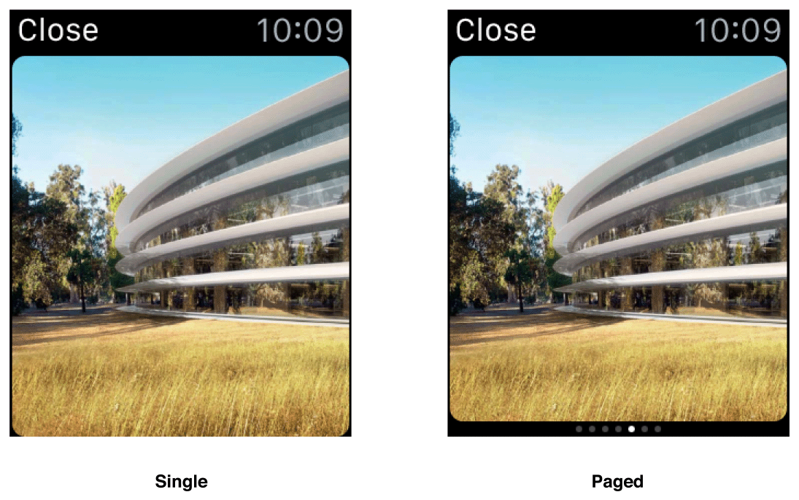

#模态页面- Modal Sheets
模态页面（ Modal sheets ）为用户提供了一种无干扰的方式来完成任务、获取信息，或者继续之前在控制菜单（ Menu control ）中做的选择。模态页面通过暂时阻止用户与 app其余部分的交互来实现该目的。
  
尽量少的在你的 app中使用模态，一般而言，仅当下列情况出现时使用模态内容：
+   当获得用户的注意很重要时。
+   当一个独立的任务必须被完成或确定放弃时，以避免用户数据处于模糊状态。

模态界面包含单个界面，或以分页布局呈现的多个界面，两者唯一的不同是，在分页界面下方加入的提示当前页面位置的圆点提示器。关闭按钮预留在模态界面的左上角，当用户点击此按钮（或者向左划过屏幕），系统会解除模态界面，无需进一步的操作。
 
   
**不要在当前内容主体中单独添加关闭按钮。**&nbsp; 系统提供的关闭按钮是强制显示的，但你可以根据需要更换它的文本内容。典型的关闭按钮文本是“关闭（ Close ）”或“取消（ Cancel ）”，其颜色通常是白色。
  
**如果任务需要接受，可在模态界面的主体部分提供一个接受按钮。**&nbsp; 为接受操作提供一个标准的按钮。点击按钮即可执行相应的动作，然后解除模态界面。
  
**保证模态的简洁。**&nbsp;
避免在初始模态界面中再显示另一个模态界面。

